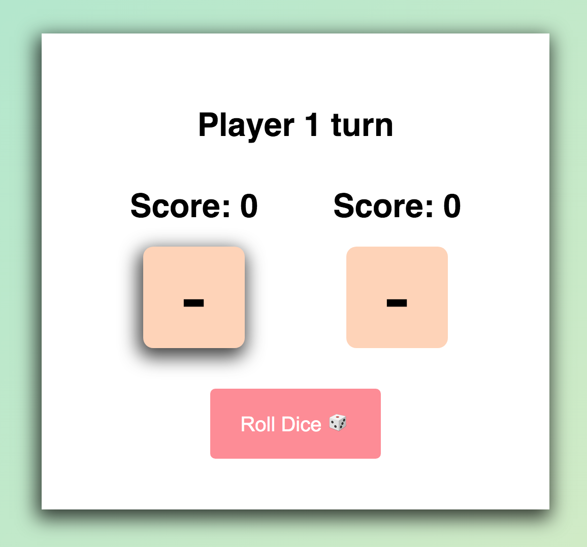
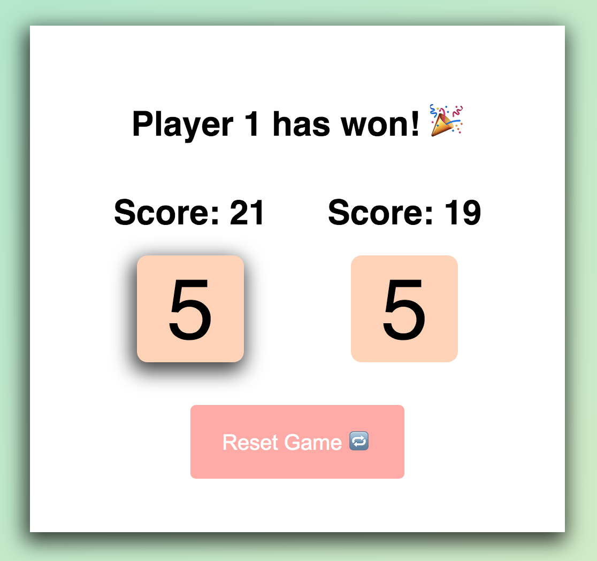

## Simple-Dice-Game

A simple dice game inspired by some teaching material and Math.random() function in javascript

It starts with turn of player 1 as shown below but dont worry the number of turns have been taken in account to have a fair game of rolling dice.

### Starting the Game

### Resetting and winner declaration

